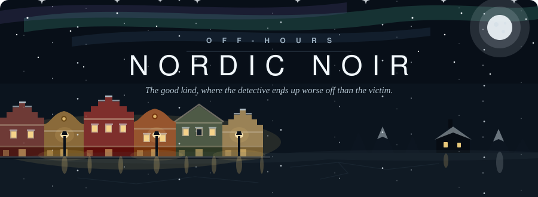

<h1 align="center">Tetiana Kravchuk</h1>

<p align="center">
  <strong>Applied AI Engineer · AI Evaluation · LLM Reliability</strong>
</p>

<p align="center">
  I build source-grounded AI systems with agents, evaluation harnesses, safety gates,<br>
  observability, and production-quality engineering.
</p>

<p align="center">
  <a href="https://tetianakravchuk.com"></a>
  <a href="https://www.linkedin.com/in/tetianakravchuk/"></a>
  <a href="https://github.com/tetianakravchuk"></a>
</p>

```console
$ pytest tetiana/ -v --tb=short

tetiana/applied_ai.py::test_source_grounded_agents .................... PASSED
tetiana/llm_eval.py::test_output_grounded_in_cited_source ............. PASSED
tetiana/llm_eval.py::test_model_admits_when_evidence_is_missing ....... PASSED
tetiana/platform.py::test_prompt_changes_require_evaluation ........... PASSED
tetiana/experience.py::test_years_in_quality_engineering .............. PASSED
tetiana/education.py::test_bu_masters_ds_ai_ml ........................ PASSED
tetiana/llm_eval.py::test_same_prompt_same_answer ..................... FAILED

========================= 6 passed, 1 failed ==========================

FAILED test_same_prompt_same_answer
  AssertionError: expected deterministic output, got a language model
  → this is why evaluation, observability, and safety gates matter
```

<p align="center">
  
</p>

## The failing test is the interesting one

I build reliable Applied AI systems around the model: source-grounded agents, evaluation
harnesses, prompt governance, safety controls, telemetry, and human-review workflows.

My foundation is more than a decade in software quality engineering and automation for
data-intensive and financial products. That experience shapes how I approach AI: important
behavior should be **testable, observable, explainable, and reversible**.

Traditional test automation assumes that the same input produces the same output. Generative
AI removes that assumption, so I evaluate what cannot be handled by an exact assertion:

- Is the answer grounded in its cited evidence?
- Does the model abstain when evidence is missing?
- Did a prompt or model change introduce a regression?
- Can a failure be traced to its data, prompt, model, cost, and latency?

The goal is not only “does it return 200?” It is **“is it right, is it grounded, and can I
evaluate it systematically?”**

## Selected work

### [World Publishing Houses AI Platform](https://tetianakravchuk.com/projects/wph-ai-platform/)

An independent publishing-intelligence platform with research agents, source-backed ingestion,
review queues, prompt governance, execution telemetry, AI evaluation, deterministic rights-safety
controls, and controlled promotion workflows.

[Live platform](https://worldpublishinghouses.com) ·
[Case study](https://tetianakravchuk.com/projects/wph-ai-platform/) ·
[Video walkthroughs](https://tetianakravchuk.com/projects/wph-ai-platform/#technical-deep-dives)

### [WPH LLM Evaluation](https://github.com/tetianakravchuk/wph-llm-eval)

A public evaluation framework that scores generated claims against cited sources. It demonstrates
golden datasets, deterministic grading, optional LLM-as-judge evaluation, hallucination detection,
groundedness checks, and regression testing.

[View code](https://github.com/tetianakravchuk/wph-llm-eval) ·
[Evaluation case study](https://tetianakravchuk.com/projects/ai-evaluation-observability/)

### [Housing Price Prediction](https://github.com/tetianakravchuk/PredictHousingPrices)

A data-science project comparing regression and tree-based models using cross-validation,
RMSE, MAE, R², residual analysis, and model-risk communication.

[View code](https://github.com/tetianakravchuk/PredictHousingPrices) ·
[Case study](https://tetianakravchuk.com/projects/housing-price-prediction/)

## Technical toolkit

**Applied AI and evaluation:** LLM evaluation, groundedness, hallucination detection, RAG,
AI agents, prompt versioning, golden datasets, model-as-judge, safety gates, tracing,
token/cost/latency telemetry, and human review.

**Data and engineering:** Python, SQL, PostgreSQL, REST APIs, FastAPI, Docker, Git, CI/CD,
Jenkins, data validation, analytics, debugging, monitoring, and dashboards.

**Quality engineering:** Java, PyTest, Selenium, Appium, REST Assured, Postman, TestNG,
JUnit, Cucumber, Sauce Labs, Zephyr, and TestRail.

<p>
  
  
  
  
  
  
  
  
</p>

## Open to

Full-time U.S.-remote opportunities in:

- Applied AI Engineering
- AI Evaluation / LLM Evaluation
- AI Platform and Reliability
- AI Observability and Safety
- Product Data Science and advanced analytics

I bring senior software-quality depth to AI systems without treating AI quality as traditional
QA. I am especially interested in teams building agents, RAG workflows, evaluation platforms,
data-intensive AI products, and trustworthy production systems.

<p align="center">
  <strong>M.S. Data Science, AI &amp; Machine Learning — Boston University, 2026</strong><br>
  Massachusetts, USA · U.S. citizen · Open to full-time U.S.-remote roles
</p>

<p align="center">
  
</p>
