<h1 align="center">Tetiana Kravchuk</h1>

<p align="center">
  <a href="https://tetianakravchuk.com">
    
  </a>
</p>

<p align="center">
  <a href="https://tetianakravchuk.com"></a>
  <a href="https://www.linkedin.com/in/tetianakravchuk/"></a>
</p>

```console
$ pytest tetiana/ -v --tb=short

tetiana/experience.py::test_years_in_automation ....................... PASSED
tetiana/experience.py::test_ships_to_regulated_fintech ................ PASSED
tetiana/experience.py::test_finds_bug_before_user_does ................ PASSED
tetiana/llm_eval.py::test_output_grounded_in_cited_source ............. PASSED
tetiana/llm_eval.py::test_same_prompt_same_answer ..................... FAILED
tetiana/llm_eval.py::test_model_admits_it_does_not_know ............... xfail
tetiana/education.py::test_bu_masters_ds_ai_ml ........................ RUNNING

======= 5 passed, 1 failed, 1 xfailed, 1 in progress =======

FAILED test_same_prompt_same_answer
  AssertionError: expected deterministic output, got a language model
  → this is the whole job
```

---

<p align="center">
  
</p>


### The failing test is the interesting one

Ten-plus years breaking software before users get the chance. Currently building quality
systems for advisor-facing financial products in wealthtech, where a rounding error is a
compliance event.

These days most of my attention goes somewhere harder. Traditional test automation assumes
the same input produces the same output — that assumption is the foundation everything else
sits on, and generative AI takes it away. So I build evaluation harnesses that score what
can't be asserted: **is this claim actually grounded in the source it cites? Did the model
hedge when it should have, or invent when it shouldn't have?**

That's the work. Not "does it return 200," but "is it *right*, and can I prove it at scale."

### 🧰 Stack


Plus REST Assured, TestNG, Sauce Labs, CI/CD pipelines, and an unreasonable fondness for a
well-named test case.

### 📌 Selected work

**[wph-llm-eval](https://github.com/tetianakravchuk/wph-llm-eval)** — evaluation framework for
LLM outputs. Scores generated claims against the sources they cite, so hallucination becomes a
number you can regression-test instead of a thing someone notices in production.

→ Full case studies at **[tetianakravchuk.com](https://tetianakravchuk.com)**

### 💬 Open to

Conversations about AI quality engineering, LLM evaluation, and senior/lead QA automation —
particularly where testing non-deterministic systems is the interesting part of the job.

<sub>Currently: M.S. Data Science, AI & Machine Learning @ Boston University, 2026 · Boston, MA</sub>

<p align="center">
  
</p>

<sub>Off-hours: Nordic noir. The good kind, where the detective ends up worse off than the victim.</sub>
